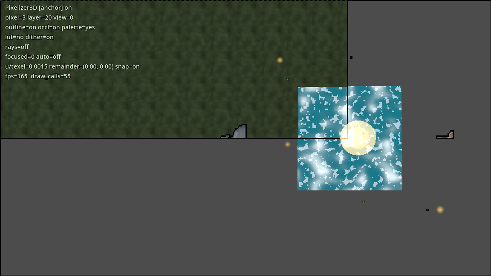

<p align="center">
  
</p>

<h1 align="center">Pixelizer3D</h1>

<p align="center">
  <b>Realtime 3D pixel art for Godot 4.7 (Forward+).</b><br>
  Snap any 3D scene onto a chunky macro-pixel lattice, ink it with clean
  screen-space outlines, grade it through a palette LUT, and light it with
  pixelated god rays and cloud shadows — all in-engine, no render-to-texture
  hackery in your game code.
</p>

<p align="center">
  <a href="addons/pixelizer_3d/README.md">Addon reference</a> ·
  <a href="#quick-start">Quick start</a> ·
  <a href="#the-demo">Demo</a> ·
  <a href="#shader-bridge">Shader bridge</a> ·
  <a href="AGENTS.md">Architecture</a>
</p>

---

## Why Pixelizer3D

Most "3D pixel art" tricks force a choice: either you render the whole game at a
tiny resolution (cheap, but every object shares one pixel grid and the HUD,
text and UI die with it), or you leave 3D alone and fake the pixels in post.
Pixelizer3D takes a different route.

It renders a hidden **metadata pass** that tags every pixelized fragment with its
object's macro-pixel size, outline id and view depth. A small compositor chain
then reconstructs the image on a per-object grid: each object gets crisp,
stable blocks of its own size, outlines are drawn between tags, and depth is
written back so foreground geometry still occludes correctly. Because it is a
compositor effect, the pixel look composites with everything else — UI, 3D, and
any shader you write — while your scene stays a normal Godot scene.

The result stays **stable while the camera moves** (a phase-anchored orthographic
snap), keeps its colour identity (a 16³ palette LUT with 16 ordered-dither
bands), and works on **ordinary materials** with no scene changes: drop in a
manager, wrap a subtree in an applier, and every mesh beneath it is pixelized.

## Feature tour

### Macro-pixel rendering, per object

Every `MeshInstance3D`, `MultiMeshInstance3D`, `GPUParticles3D` and
`CPUParticles3D` under a `PixelizerApplier3D` is converted automatically.
Pixel size is a live, per-object setting (`1`–`5`), and **`UNIFIED` anchor mode**
pins a whole group to one world-origin lattice so terrain chunks and grass share
one grid with no seams.

<p align="center">
  
</p>

### Screen-space outlines & subject focus

A 256-id outline palette draws silhouette **and** inner-depth edges as clean
screen-space lines that thicken and break the way hand-drawn ink does. Tag an
object (or a whole applier subtree), override a single id's colour, or hide an
outline entirely — per object or inherited from the applier. An object can also
opt out of the silhouette tint into a reserved **focus** id.

### Palette LUT + ordered dither

Bake a 16³-colour LUT (256×256, 16 dither bands) and the shader grades every
pixelized fragment into it, with the dither band driven by the macro grid
(never screen space, so it scrolls with the world, not the camera). Grading runs
after the anchor clip, so the palette rides the pixel blocks.

### A 3-pass compositor pipeline

All of it runs on the GPU as `CompositorEffect`s, in this fixed order:

```
god_rays  →  snapshot  →  apply_pixelization
(compute,    (compute,     (raster + depth write-back: inline 5x5 anchor search,
 additive)    colour+depth  replicate blocks, outlines, dither grade)
              in one pass)
```

God rays run *first* and write into the scene colour, so the rays themselves are
replicated into macro-pixels like everything else. Depth write-back is why the
foreground reads correctly through the pixel blocks. The anchor map is computed
inline in the apply pass (one full-screen dispatch fewer).

### Effects that share one world

- **God rays** march the same cloud field as the shadows, so light shafts open
  exactly where the clouds have gaps.
- **Cloud shadows** are sun-projected, optionally banded, and pushed to every
  registered receiver (terrain, water, custom materials).
- **Water** is an opaque, banded coast shader that receives the same clouds.
- **Fireflies**, **point-light volumes**, and a **day/night rig** drive
  ambient, sky and sun ramps from a normalized time of day.
- **Low-res SubViewport mode** gives you a single uniform low-res lattice
  (with a sharp-bilinear upscale and smooth sub-texel scroll) when you don't
  need per-object sizes.

### A status HUD, tuned from the editor

Enable `PixelizerDiagnosticsOverlay` and press `Tab` in game for a live status
readout (pipeline state, pixel size, ray/palette flags, FPS, draw calls). Live
tuning is done through Godot's remote inspector, not an in-game panel.

<p align="center">
  
</p>

## Quick start

1. Copy `addons/pixelizer_3d/` into your Godot 4.7 project and enable the plugin
   in **Project Settings → Plugins**.
2. Add a `PixelizerManager3D` and point `sun` at your `DirectionalLight3D`.
   The manager auto-follows the viewport's current `Camera3D`, so switching
   cameras at runtime just works (call `set_target_camera()` to pin one).
3. Add a `PixelizerApplier3D` and parent your world content under it.

```gdscript
var manager := PixelizerManager3D.new()
manager.sun = sun
manager.pixel_size = 3
add_child(manager)

var applier := PixelizerApplier3D.new()
applier.pixel_size = 3
applier.anchor_mode = PixelizerObject3D.AnchorMode.UNIFIED
applier.dither_enabled = 1
add_child(applier)
# anything parented under `applier` is now pixelized

# Optional effects are separate scene nodes — add only what the scene needs:
#   PixelizerSkyClouds3D (cloud shadows / deck), PixelizerGodRays3D,
#   PixelizerWater3D, PixelizerFireflies3D, ... Each registers itself.
```

Have a shader of your own? Include the macros header, call the entry points, and
register the material:

```gdscript
# in your .gdshader:
#   #include "res://addons/pixelizer_3d/shaders/anchor_macros.gdshaderinc"
manager.register_pixelized_material(my_material)
```

> Requirements: Godot **4.7**, **Forward+**, MSAA/TAA off. Compatibility and
> headless fall back with a warning (low-res mode still runs on Mobile).

## The demo

This repository is also the reference project — open it in Godot 4.7 and press
**F5**. The main scene is `demo/demo.tscn`.

You play a **Knight** (`CharacterBody3D` + arcball camera) in a
`MarchingSquaresTerrain` bowl with a grass planter, six KayKit adventurer
characters lined up in the distance, a firefly swarm, a point-light volume, a
sky cloud deck and a water plane — all sitting under a `PixelizerManager3D` +
`PixelizerApplier3D`.

<p align="center">
  
</p>

**Controls**

| Input | Action |
|---|---|
| `WASD` | Move (camera-relative) |
| `Space` | Jump |
| Arrow keys | Orbit camera (yaw / pitch) |
| Mouse drag | Orbit camera |
| Wheel | Zoom (2–14 m) |
| `Tab` | Toggle the `PixelizerDiagnosticsOverlay` status HUD |

The demo is wired to the **shader bridge**: the vendored
`MarchingSquaresTerrain` shaders are approved and generated into
`res://pixelizer_bridges/` (a generated artifact — delete it and rerun
`tests/bridge/generate_bridges.gd` to rebuild). The terrain applier uses
`pixel_size = 5`, `UNIFIED` anchor mode and a black outline override so the
chunk seams stay invisible.

## Shader bridge

Third-party shaders that can't be edited still join the pipeline. The **shader
bridge** does an explicit, reviewable **editor-time text transform** that writes
a separate generated `.gdshader` plus a manifest; at runtime the game only does
a manifest lookup and an in-place `material.shader` swap — **no runtime source
generation, and the source addon is never written to.**

1. Open **Project → Tools → Pixelizer3D Shader Bridge**.
2. Set the manifest, an output dir **outside** the scanned addon roots, and the
   roots to scan.
3. **Scan** to classify every spatial shader, **Approve** the ones you want,
   **Preview** the injected diff, then **Generate approved**.
4. Point your manager's `bridge_manifests` at the manifest and enable
   `auto_bridge_custom_shaders`.

Stale, unapproved, missing-output or version-mismatched entries are never
applied. The failure mode is always "rendered as authored", never a broken
shader.

<p align="center">
  
</p>

## Editor integration

The addon adds a bridge dock and registers the **Bake PaletteLUT to PNG** tool.
Every node exposes its settings as inspector export groups, and the applier
options inherit cleanly down the tree.

<p align="center">
  
  
</p>

## Nodes at a glance

| Node | What it does |
|---|---|
| `PixelizerManager3D` | The pipeline driver: metadata viewport/camera, compositor passes, shared settings. Auto-follows the active camera. One per viewport. |
| `PixelizerApplier3D` | Subtree pixelizer with inheritable per-group settings. |
| `PixelizerObject3D` | **Manual-only** per-object override node (place one as a child of a supported geometry node). |
| `PixelizerSkyClouds3D` · `PixelizerGodRays3D` · `PixelizerWater3D` · `PixelizerPointLightVolume3D` · `PixelizerFireflies3D` · `PixelizerDayNight3D` | Optional per-scene effect nodes (add only what you need). |
| `PixelizerCameraController3D` · `PixelizerDiagnosticsOverlay` | Optional camera rig and status HUD. |

## Repository layout

```
addons/pixelizer_3d/   the addon (copy this into your project)
demo/                  the playable demo scene and assets
pixelizer_bridges/     generated bridge shaders + manifest (demo)
tests/                 capture harness + headless bridge fixtures
docs/images/           screenshots used in this README
AGENTS.md              architecture and load-bearing invariants
CREDITS.md             inspiration, assets and licenses
```

## Tests

Headless shader-bridge fixtures, capture regression tooling and a windowed
compile smoke test all live in `tests/` — see [`tests/README.md`](tests/README.md).

## Credits

Pixelizer3D stands on the shoulders of several open-source Godot pixel-art
projects and the KayKit character pack. The full list, with licenses, is in
[`CREDITS.md`](CREDITS.md).
